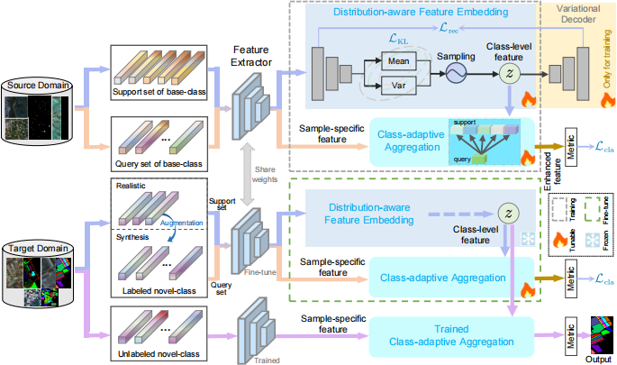

# Distribution-Aware and Class-Adaptive Aggregation for Few-Shot Hyperspectral Image Classification

Code for the paper: [Distribution-Aware and Class-Adaptive Aggregation for Few-Shot Hyperspectral Image Classification](https://ieeexplore.ieee.org/document/10606525).

<p align='center'>
  
</p>

## Abstract:
Recently, few-shot learning based on meta-learning has shown great potential in hyperspectral image classification (HSIC) due to its excellent adaptability to limited training samples. Despite achieving promising results, the existing methods ignore the interaction between the source domain (with abundant-labeled base-class samples) and the target domain (with few-labeled novel-class samples), as well as between the support set and the query set. This issue makes the resulting model usually biased toward the source domain and not robust to the sample variance of novel classes, posing a bottleneck to the improvement of HSIC performance. To overcome these limitations, we propose a flexible and effective distribution-aware and class-adaptive aggregation (DA-CAA) method for few-shot HSIC by transferring the class-level distribution information learned from the base classes to the novel classes. Specifically, we first employ a variational autoencoder (VAE), which is pretrained on abundant-labeled base-class samples, to encode the support set samples as class distributions. Subsequently, we sample class-level features from the learned distribution and adaptively aggregate them with sample-specific query features. This operation not only enhances cross-domain information interaction in a distribution-learning manner, but also ensures that the aggregated features across classes inherit both class-level and sample-specific information. Our proposed class-adaptive aggregation (CAA) encourages complementary fusion of features from all classes, which is beneficial for reducing class confusion. Experiments on four benchmark datasets demonstrate the effectiveness and flexibility of our approach.

## Paper

Please cite our paper if you find the code or dataset useful for your research.
```
@ARTICLE{10606525,
  author={Guo, Ying and Fan, Bin and Feng, Yan and Jia, Xiuping and He, Mingyi},
  journal={IEEE Transactions on Geoscience and Remote Sensing}, 
  title={Distribution-Aware and Class-Adaptive Aggregation for Few-Shot Hyperspectral Image Classification}, 
  year={2024},
  volume={62},
  number={},
  pages={1-16},
  keywords={Training;Feature extraction;Task analysis;Metalearning;Adaptation models;Image classification;Few shot learning;Feature aggregation;few-shot learning;hyperspectral image classification (HSIC);variational autoencoder (VAE)},
  doi={10.1109/TGRS.2024.3432734}}

```

## Requirements

CUDA Version: 11.6

torch: 1.13.0

Python: 3.9

## Datasets

```

```

Thank you for your interest!

Concact: yingguo@mail.nwpu.edu.cn
